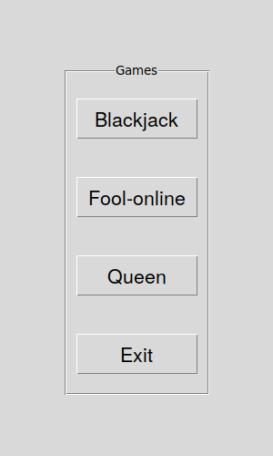
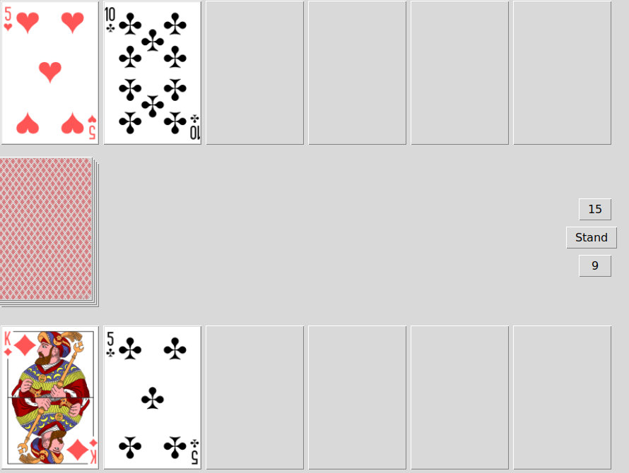
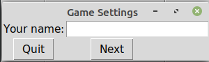
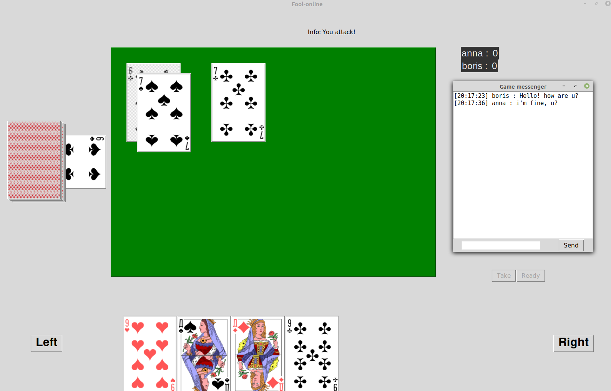

# Карточные игры
## Участники
- Бабичев Андрей Юрьевич, 522 группа, https://github.com/AndrewBabichev
- Колмагоров Евгений Игоревич, 517 группа, https://github.com/ekolmagorov

## Постановка задачи
Реализовать приложение для игры в различные карточные игры. Предполагается реализация трёх игр:
- Блекджэк (21);
- Дурак;
- Пиковая дама;

В игре дурак предполагается возможность онлайн-игры.

## Интерфейс
Интерфейс главного меню с выбором игры:

Интерфейс одной из игр (блекджэк):

Интрефейс настроек подключения.

Необходимо ввести имя пользователя на английском языке

Интерфейс игры-дурак онлайн, есть возможность для переписки у игроков,
имеется лидерборд игроков в пределах игровой сессии.
